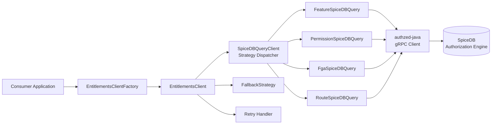
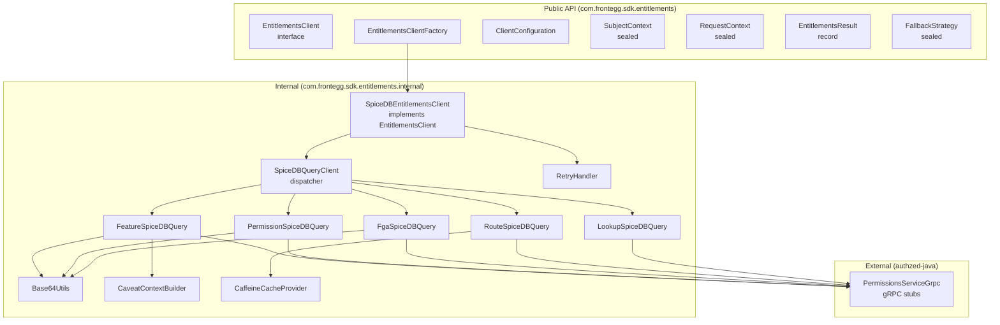
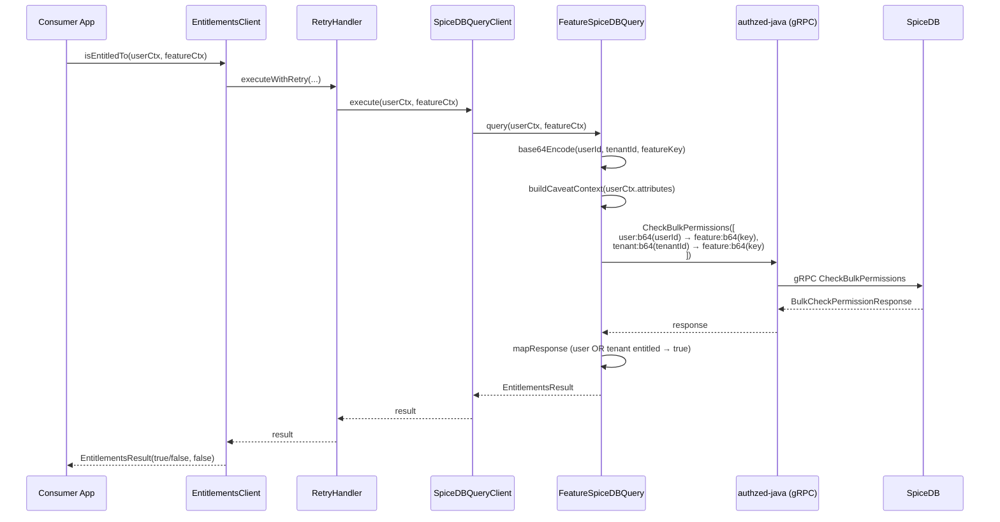
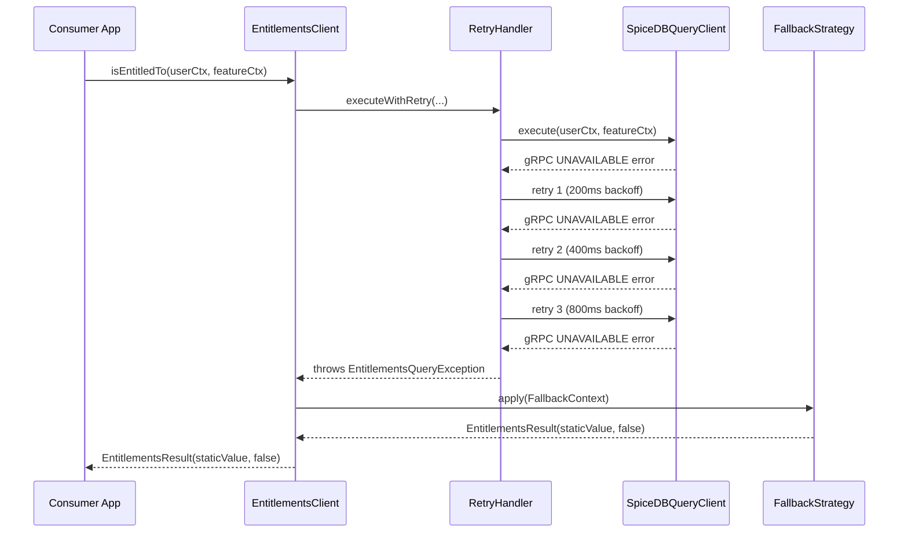

# Entitlements Client Java SDK — Architecture Document

## Introduction

This document outlines the architecture for the `entitlements-client-java` SDK, a Java client library for Frontegg's ReBAC authorization engine (SpiceDB-backed). It serves as the guiding blueprint for AI-driven development, ensuring consistency and adherence to chosen patterns and technologies.

This is a **client library** (not a service) — there is no frontend, no UI, no server component. The architecture focuses on API design, gRPC integration, error handling, and packaging.

**Starter Template / Existing Project:** N/A — greenfield Java library project. The TypeScript SDK (`@frontegg/e10s-client`) serves as the functional reference but not a code template.

### Change Log

| Date | Version | Description | Author |
|------|---------|-------------|--------|
| 2026-03-11 | 0.1 | Initial architecture draft | AI-assisted |

---

## High Level Architecture

### Technical Summary

The SDK is a thin Java client library that wraps SpiceDB's gRPC API via the `authzed-java` client. It uses a **Strategy pattern** to dispatch entitlement queries (Feature, Permission, FGA) to specialized query handlers, each constructing the appropriate SpiceDB `CheckPermission` or `CheckBulkPermissions` gRPC request. The library is built with Maven, targets Java 17, and uses sealed interfaces and records for a type-safe, immutable public API. A single shared `ManagedChannel` handles all gRPC communication with HTTP/2 multiplexing. The architecture directly supports the PRD goals of API parity with the TypeScript SDK, minimal maintenance, and production-grade resilience.

### High Level Overview

1. **Architecture style**: Client library (SDK) — not a service, monolith, or microservice
2. **Repository structure**: Multi-module Maven project — core library, BOM, Spring Boot starter, and test utilities
3. **Service architecture**: N/A — this is consumed by services, not a service itself
4. **Primary data flow**: Consumer application → SDK (`isEntitledTo`) → Strategy dispatcher → SpiceDB query handler → gRPC call to SpiceDB → Result mapping → Return to consumer
5. **Key architectural decisions**:
   - Strategy pattern for query dispatch (matches TS SDK architecture)
   - Sealed interfaces for type-safe union types (`RequestContext`, `SubjectContext`, `FallbackStrategy`)
   - Factory + Builder pattern for client instantiation
   - `CompletableFuture` for async API, blocking wrapper for sync API
   - `AutoCloseable` for gRPC channel lifecycle management

### High Level Project Diagram



### Architectural and Design Patterns

- **Strategy Pattern**: Each `RequestContext` type (Feature, Permission, FGA, Route) is handled by a dedicated query strategy class. The `SpiceDBQueryClient` dispatches to the correct strategy based on the sealed type. — _Rationale:_ Matches the TS SDK's architecture, enables clean separation of query logic, and makes adding new query types straightforward.

- **Factory Pattern + Builder Pattern**: `EntitlementsClientFactory.create(config)` validates and instantiates the client. `ClientConfiguration.builder()` provides a fluent API for configuration. — _Rationale:_ Factory validates invariants at creation time; Builder provides ergonomic Java API for multi-field configuration.

- **Sealed Interface / Record Pattern**: Domain types (`RequestContext`, `SubjectContext`, `FallbackStrategy`) use sealed interfaces with record implementations. — _Rationale:_ Provides exhaustive type checking (compiler verifies all cases are handled), immutability by default, and clean mapping to the TS SDK's union types.

- **Adapter Pattern**: The `internal` package wraps `authzed-java` gRPC types, preventing leakage of protobuf/gRPC types into the public API. — _Rationale:_ Consumers never depend on protobuf or gRPC types directly, enabling us to upgrade or replace the gRPC layer without breaking the public API.

---

## Tech Stack

### Cloud Infrastructure

N/A — This is a client library published to Maven Central. No cloud infrastructure is required for the library itself. CI/CD runs on GitHub Actions.

### Technology Stack Table

| Category | Technology | Version | Purpose | Rationale |
|----------|-----------|---------|---------|-----------|
| **Language** | Java | 17 | Primary language | LTS, sealed classes + records for type-safe API, required by Spring Boot 3.x |
| **Build** | Maven | 3.9+ | Build and dependency management | Declarative, stable, minimal maintenance drift vs Gradle |
| **SpiceDB Client** | authzed-java | 1.5.4 | gRPC client for SpiceDB | Official client, includes grpc-netty-shaded, actively maintained |
| **gRPC** | grpc-java | 1.78.0 | gRPC transport (via authzed-java) | Transitive dep from authzed-java, uses shaded Netty |
| **Protobuf** | protobuf-java | 4.33.5 | Protocol Buffers (via authzed-java) | Transitive dep from authzed-java |
| **Logging** | SLF4J API | 2.0.x | Logging facade | Universal Java logging facade, no implementation forced |
| **Caching** | Caffeine | 3.1.x | In-memory caching | High-performance, thread-safe, Java 11+ compatible |
| **Spring Integration** | Spring Boot (provided) | 3.2+ | Auto-configuration for Spring starter module | Provided scope — no forced Spring dependency for non-Spring consumers |
| **Testing** | JUnit 5 | 5.10.x | Test framework | Industry standard, parameterized tests, extensions |
| **Testing** | Mockito | 5.x | Mocking library | De facto standard for Java mocking |
| **Testing** | SLF4J Simple | 2.0.x | Test logging impl | Lightweight, test-scope only |
| **Publishing** | central-publishing-maven-plugin | 0.10.0 | Maven Central publishing | Sonatype Central Portal (replaces deprecated nexus-staging) |
| **Signing** | maven-gpg-plugin | 3.2.7 | Artifact signing | Required for Maven Central |
| **CI/CD** | GitHub Actions | N/A | Continuous integration & deployment | Standard for OSS, matrix builds |
| **Versioning** | semantic-release | latest | Automated versioning | Conventional commits, matches TS SDK approach |

---

## Data Models

This SDK does not own data — it constructs gRPC requests and maps responses. The "data models" are the public API types:

### SubjectContext (sealed interface)

**Purpose:** Identifies who is being checked for entitlements.

**Implementations:**
- `UserSubjectContext(userId: String, tenantId: String, attributes: Map<String, Object>)` — A Frontegg user within a tenant
- `EntitySubjectContext(entityType: String, entityId: String)` — An arbitrary entity for FGA checks

**SpiceDB Mapping:**
- `UserSubjectContext` → subject `frontegg_user:<base64(userId)>` + tenant check `frontegg_tenant:<base64(tenantId)>`
- `EntitySubjectContext` → subject `<entityType>:<base64(entityId)>`

### RequestContext (sealed interface)

**Purpose:** Defines what entitlement is being checked.

**Implementations:**
- `FeatureRequestContext(featureKey: String)` — Check access to a named feature
- `PermissionRequestContext(permissionKeys: List<String>)` — Check one or more permissions
- `EntityRequestContext(resourceType: String, resourceId: String, relation: String)` — FGA entity check
- `RouteRequestContext(method: String, path: String)` — Route check (regex match against cached SpiceDB relationships)

**SpiceDB Mapping:**
- `FeatureRequestContext` → resource `frontegg_feature:<base64(featureKey)>`, relation `entitled`
- `PermissionRequestContext` → resource `frontegg_permission:<base64(permissionKey)>`, relation `entitled`
- `EntityRequestContext` → resource `<resourceType>:<base64(resourceId)>`, relation from request
- `RouteRequestContext` → reads `frontegg_route` relationships, regex match against cached route records

### EntitlementsResult (record)

**Purpose:** The result of an entitlement check.

**Attributes:**
- `result: boolean` — Whether the subject is entitled
- `monitoring: boolean` — Whether this was a monitoring-mode check (always returns true)

**Factory methods:** `EntitlementsResult.allowed()`, `EntitlementsResult.denied()`

### ClientConfiguration (builder)

**Purpose:** Configuration for creating an EntitlementsClient.

**Required attributes:**
- `engineEndpoint: String` — SpiceDB gRPC endpoint URL
- `engineToken: String | Supplier<String>` — Bearer token (Supplier enables rotation)

**Optional attributes:**
- `fallbackStrategy: FallbackStrategy` — Error fallback behavior (default: none, throw)
- `requestTimeout: Duration` — gRPC deadline (default: 5s)
- `bulkRequestTimeout: Duration` — Bulk check deadline (default: 15s)
- `maxRetries: int` — Retry count for transient errors (default: 3)
- `useTls: boolean` — Enable TLS (default: true)

---

## Components

### EntitlementsClientFactory

**Responsibility:** Validates `ClientConfiguration`, creates `ManagedChannel`, instantiates and returns `EntitlementsClient`.

**Key Interfaces:**
- `static EntitlementsClient create(ClientConfiguration config)`

**Dependencies:** `ClientConfiguration`, `ManagedChannel` (gRPC)

### SpiceDBEntitlementsClient (implements EntitlementsClient)

**Responsibility:** Core client implementation. Delegates to `SpiceDBQueryClient` for query dispatch, applies fallback and retry logic, manages channel lifecycle.

**Key Interfaces:**
- `EntitlementsResult isEntitledTo(SubjectContext, RequestContext)`
- `CompletableFuture<EntitlementsResult> isEntitledToAsync(SubjectContext, RequestContext)`
- `void close()`

**Dependencies:** `SpiceDBQueryClient`, `FallbackStrategy`, `RetryHandler`, `ManagedChannel`

### SpiceDBQueryClient (strategy dispatcher)

**Responsibility:** Maps `RequestContext` type to the correct query strategy and executes it.

**Key Interfaces:**
- `EntitlementsResult execute(SubjectContext, RequestContext)`

**Dependencies:** `FeatureSpiceDBQuery`, `PermissionSpiceDBQuery`, `FgaSpiceDBQuery`, authzed-java stubs

### Query Strategies (internal)

**Responsibility:** Each strategy constructs the SpiceDB gRPC request for its query type and maps the response.

**Implementations:**
- `FeatureSpiceDBQuery` — `CheckBulkPermissions` for feature entitlements (user + tenant)
- `PermissionSpiceDBQuery` — `CheckBulkPermissions` for permission entitlements (user + tenant, multiple keys)
- `FgaSpiceDBQuery` — `CheckPermission` for entity-to-entity authorization
- `RouteSpiceDBQuery` — Route matching with cached relationships
- `LookupSpiceDBQuery` — Dispatches `LookupResources` and `LookupSubjects` RPCs

**Dependencies:** authzed-java gRPC stubs, `Base64Utils`, `CaveatContextBuilder`

### RetryHandler (internal)

**Responsibility:** Implements exponential backoff with jitter for retryable gRPC errors.

**Key Interfaces:**
- `<T> T executeWithRetry(Supplier<T> action, int maxRetries)`

**Dependencies:** None (self-contained utility)

### Component Diagram



---

## External APIs

### SpiceDB gRPC API

- **Purpose:** Authorization engine backend — all entitlement checks are resolved here
- **Documentation:** https://buf.build/authzed/api/docs/main:authzed.api.v1
- **Base URL(s):** Configured via `ClientConfiguration.engineEndpoint`
- **Authentication:** Bearer token via gRPC `CallCredentials` (configured via `ClientConfiguration.engineToken`)
- **Rate Limits:** Depends on SpiceDB deployment configuration

**Key RPCs Used:**
- `CheckPermission` — Single permission check (used for FGA entity checks)
- `CheckBulkPermissions` — Batch permission check (used for Feature and Permission checks)
- `LookupResources` — Find resources a subject can access (used by `LookupSpiceDBQuery`)
- `LookupSubjects` — Find subjects with access to a resource (used by `LookupSpiceDBQuery`)

**Integration Notes:**
- All object IDs are Base64 URL-safe encoded (no padding) before sending to SpiceDB
- Caveat context is attached as `google.protobuf.Struct` with user attributes
- `active_at` caveat enables time-based access checks

---

## Core Workflows

### Feature Entitlement Check



### Fallback on Error



---

## Source Tree

See [docs/architecture/source-tree.md](architecture/source-tree.md) for the full annotated file tree.

The repository is a multi-module Maven project with four modules:

| Module | Artifact ID | Purpose |
|--------|-------------|---------|
| `src/` | `entitlements-client` | Core library — public API and internal implementation |
| `entitlements-client-bom/` | `entitlements-client-bom` | Bill of Materials POM for consumer dependency alignment |
| `entitlements-client-spring-boot-starter/` | `entitlements-client-spring-boot-starter` | Spring Boot auto-configuration (`@ConfigurationProperties` + `@Bean`) |
| `entitlements-client-test/` | `entitlements-client-test` | Test utilities — `MockEntitlementsClient` and `RecordingEntitlementsClient` |

---

## Infrastructure and Deployment

### Infrastructure as Code

N/A — Client library, no infrastructure to deploy.

### Deployment Strategy

- **Strategy:** Publish JAR artifacts to Maven Central on tagged releases
- **CI/CD Platform:** GitHub Actions
- **Pipeline Configuration:** `.github/workflows/ci.yaml` (PR checks), `.github/workflows/publish.yaml` (release)

### Environments

- **CI**: GitHub Actions runners (ubuntu-latest), Java 17 + 21 matrix
- **Maven Central Staging**: Sonatype Central Portal validation (automatic on deploy)
- **Maven Central Release**: Public artifact repository (automatic after staging validation)

### Promotion Flow

```
PR → CI (build + test, Java 17+21)
     ↓ merge to main
main → CI (build + test)
     ↓ git tag v*
tag → Publish workflow → Maven Central staging → validation → release
```

### Rollback Strategy

- **Primary Method:** Publish a new patch version with the fix. Maven Central artifacts are immutable (cannot be deleted or overwritten).
- **Trigger Conditions:** Critical bug or security vulnerability in published artifact
- **Recovery Time Objective:** New patch release within hours

---

## Error Handling Strategy

### General Approach

- **Error Model:** Unchecked exceptions only. No checked exceptions in public API.
- **Exception Hierarchy:**
  ```
  EntitlementsException (RuntimeException)
  ├── ConfigurationMissingException    — missing required config field
  ├── ConfigurationInvalidException    — invalid config value
  └── EntitlementsQueryException       — SpiceDB query failure
      └── EntitlementsTimeoutException — gRPC deadline exceeded
  ```
- **Error Propagation:** gRPC `StatusRuntimeException` is caught at the adapter boundary and wrapped in SDK exception types. Protobuf/gRPC types never leak to consumers.

### Logging Standards

- **Library:** SLF4J 2.0.x (facade only)
- **Format:** Structured key-value pairs in message: `"Checking entitlement subject={} resource={} relation={}"`
- **Levels:**
  - `ERROR`: Unrecoverable failures (configuration errors, fallback failures)
  - `WARN`: Fallback activated, retry exhausted, forced channel shutdown
  - `INFO`: Monitoring mode results, client creation/close
  - `DEBUG`: Individual check inputs/outputs, cache hits/misses
  - `TRACE`: Raw gRPC request/response (with token redacted)
- **Required Context:** Subject type + ID (hashed if PII risk), request context type, duration_ms

### Error Handling Patterns

#### External API Errors (SpiceDB gRPC)

- **Retry Policy:** Exponential backoff with jitter for `UNAVAILABLE` and `DEADLINE_EXCEEDED`. Base 200ms, factor 2, max 2s, max 3 retries.
- **Circuit Breaker:** Not included in SDK. Consumers can wrap with Resilience4j if needed.
- **Timeout Configuration:** Default 5s (`CheckPermission`), 15s (`CheckBulkPermissions`). Configurable via `ClientConfiguration.requestTimeout` / `bulkRequestTimeout`.
- **Error Translation:** `StatusRuntimeException` → `EntitlementsQueryException` (general) or `EntitlementsTimeoutException` (`DEADLINE_EXCEEDED`)

#### Business Logic Errors

- **Custom Exceptions:** `ConfigurationMissingException(fieldName)`, `ConfigurationInvalidException(message)`
- **User-Facing Errors:** Actionable messages with fix instructions, e.g., "engineEndpoint is required. Set via ClientConfiguration.builder().engineEndpoint(...)"
- **Error Codes:** Not used — exception types serve as error codes

---

## Coding Standards

### Core Standards

- **Language & Runtime:** Java 17+
- **Style & Linting:** Standard Java conventions. Consider adding Checkstyle or Spotless for automated enforcement.
- **Test Organization:** `src/test/java` mirrors `src/main/java` structure. Test classes named `*Test.java`.

### Naming Conventions

| Element | Convention | Example |
|---------|-----------|---------|
| Packages | lowercase, no underscores | `com.frontegg.sdk.entitlements.internal` |
| Classes/Interfaces | PascalCase | `SpiceDBEntitlementsClient` |
| Records | PascalCase | `EntitlementsResult` |
| Methods | camelCase | `isEntitledTo` |
| Constants | UPPER_SNAKE_CASE | `DEFAULT_REQUEST_TIMEOUT` |
| Builder methods | camelCase, no `set` prefix | `.engineEndpoint("...")` |

### Critical Rules

- **No protobuf/gRPC types in public API:** All authzed-java and gRPC types stay in `internal` package. Public API uses only SDK-defined types.
- **All public types must be immutable:** Records by default, classes must have only `final` fields with no setters.
- **Thread safety by design:** No mutable shared state. Strategies must be stateless. Configuration is frozen after build.
- **Base64 encoding must match TypeScript SDK:** Use `Base64.getUrlEncoder().withoutPadding().encodeToString(value.getBytes(StandardCharsets.UTF_8))` — never any other encoding.
- **Never log tokens or secrets:** The `engineToken` must be redacted in all log output and exception messages.
- **Use SLF4J, never System.out/err:** All logging via `LoggerFactory.getLogger(ClassName.class)`.

### Java-Specific Guidelines

- **Use records for DTOs:** All value types crossing API boundaries must be records (not classes with getters).
- **Use sealed interfaces for union types:** `SubjectContext`, `RequestContext`, `FallbackStrategy` must be sealed with `permits` clause.
- **Use `Optional` sparingly:** Only for truly optional return values. Never as method parameters.
- **Prefer `Supplier<String>` for tokens:** Enables credential rotation without client reinstantiation.

---

## Test Strategy and Standards

### Testing Philosophy

- **Approach:** Test-after for core logic (pragmatic — porting known-working logic from TS SDK). New features added with TDD.
- **Coverage Goals:** 70% minimum across statements, branches, functions, lines. Factory and query strategies target 90%+.
- **Test Pyramid:** Mostly unit tests (mocked gRPC stubs), with cross-language compatibility tests for Base64 encoding.

### Test Types and Organization

#### Unit Tests

- **Framework:** JUnit 5 (5.10.x)
- **File Convention:** `*Test.java` in matching package under `src/test/java`
- **Location:** `src/test/java/com/frontegg/sdk/entitlements/`
- **Mocking Library:** Mockito 5.x
- **Coverage Requirement:** 70% overall, 90% for factory + query strategies

**AI Agent Requirements:**
- Generate tests for all public methods
- Cover edge cases and error conditions
- Follow AAA pattern (Arrange, Act, Assert)
- Mock all gRPC stubs — never make real network calls in unit tests

#### Integration Tests

- **Scope:** End-to-end tests against real SpiceDB instance
- **Location:** `src/test/java/com/frontegg/sdk/entitlements/integration/`
- **Test Infrastructure:**
  - **SpiceDB:** Testcontainers with `authzed/spicedb` Docker image
  - **Schema:** Test SpiceDB schema loaded via test fixtures

#### Cross-Language Compatibility Tests

- **Scope:** Verify Base64 encoding output matches TypeScript SDK for a known set of inputs
- **Location:** `src/test/java/com/frontegg/sdk/entitlements/internal/Base64UtilsTest.java`
- **Data:** Hardcoded input/output pairs verified against running the TS SDK's `normalizeObjectId`

### Test Data Management

- **Strategy:** Hardcoded test fixtures in test classes.
- **Factories:** Builder pattern on domain types serves as test factory. `MockEntitlementsClient` and `RecordingEntitlementsClient` from `entitlements-client-test` module provide reusable test doubles.
- **Cleanup:** Stateless tests — no cleanup needed.

### Continuous Testing

- **CI Integration:** `mvn verify` runs on every PR and push to main. Matrix: Java 17 + 21.
- **Performance Tests:** Consider JMH benchmarks for gRPC call overhead in a future iteration.
- **Security Tests:** Dependabot for dependency vulnerabilities.

---

## Security

### Input Validation

- **Validation Location:** `EntitlementsClientFactory.create()` validates configuration. Query strategies validate subject/request context fields.
- **Required Rules:**
  - `engineEndpoint` and `engineToken` must be non-null, non-empty
  - Subject IDs and resource IDs must be non-null (Base64 encoding fails on null)
  - Feature keys, permission keys, entity types must be non-empty strings

### Authentication & Authorization

- **Auth Method:** Bearer token via gRPC `CallCredentials`, attached to every RPC
- **Token Management:** `Supplier<String>` pattern enables credential rotation without recreating client
- **Required Patterns:**
  - Token is never stored as a plain `String` field — always accessed via `CallCredentials` at call time
  - Token is redacted in all log output and exception messages

### Secrets Management

- **Development:** Environment variables (`ENTITLEMENTS_ENGINE_TOKEN`)
- **Production:** Consumer's responsibility — SDK accepts `Supplier<String>` for integration with vault/secret manager
- **Code Requirements:**
  - NEVER hardcode tokens in examples (use `System.getenv()` or placeholder)
  - No tokens in logs, exception messages, or `toString()` output

### Dependency Security

- **Scanning Tool:** GitHub Dependabot (automatic)
- **Update Policy:** Dependabot PRs reviewed weekly
- **Approval Process:** All dependency updates must pass CI before merge

---

## Local Development Setup

### Prerequisites
- Java 17+ (verify: `java -version`)
- Maven 3.9+ (verify: `mvn -version`)
- Git

### Build & Test
```bash
# Clone and build
git clone https://github.com/frontegg/entitlements-client-java.git
cd entitlements-client-java
mvn compile          # Build
mvn verify           # Build + run tests
mvn test             # Run tests only
```

No external services or environment variables are required for unit tests (all gRPC calls are mocked).

### IDE Setup
- Import as Maven project in IntelliJ IDEA / VS Code
- Java 17 SDK must be configured
- No additional plugins required

---

## Observability & Metrics

The SDK provides **SLF4J logging only**. Metrics (Micrometer), distributed tracing (OpenTelemetry), and alerting are consumer responsibilities. Consumers who need metrics should wrap SDK calls with their own instrumentation. Optional Micrometer and OpenTelemetry companion modules may be evaluated in future iterations.

Rate limiting and DoS protection are the responsibility of the SpiceDB deployment, not the client SDK.

---

## Next Steps

1. Add integration tests using Testcontainers against a real SpiceDB instance
2. Evaluate optional Micrometer companion module for metrics instrumentation
3. Consider Checkstyle or Spotless for automated style enforcement in CI
